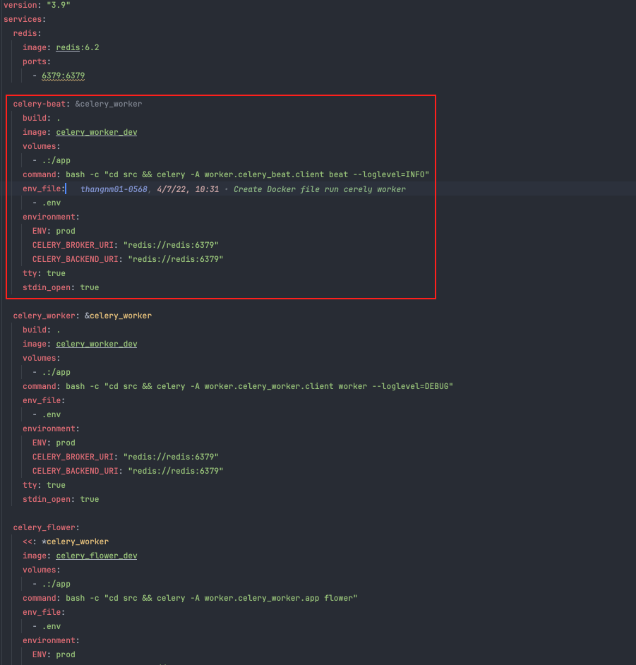

# How to Create a Cron Job with Celery

## Setting `celery_beat`

#####  Create a new file named `celery_beat.py` in the `src/worker` folder

  ```python
  from pydantic import BaseSettings
  from celery import Celery

    class CelerySettings(BaseSettings):
        celery_broker_uri: str
        celery_backend_uri: str

    settings = CelerySettings()

    client = Celery(
        'app',
        broker=settings.celery_broker_uri,
        backend=settings.celery_backend_uri,
    )

    client.conf.timezone = 'UTC'
    client.conf.beat_schedule = {
        # Setting up a cron job
        'task-schedule-name': { 
            # This will call the worker.cron_tasks.push_encourage_user_open_app_cron function in src/worker/cron_tasks.py
            'task': 'worker.tasks.worker.cron_tasks.push_encourage_user_open_app', 
            # Run every hour (3600 seconds)
            'schedule': 3600.0,  
        },
    }
  ```

- This setup will configure a Celery beat scheduler to run a task every hour by calling the `push_encourage_user_open_app_cron` function in the `src/worker/cron_tasks.py` file.
- `schedule`: Configuration-based [documentation on periodic tasks](https://docs.celeryq.dev/en/stable/userguide/periodic-tasks.html)

##### Modify the docker-compose-worker.yml configuration

  ```docker

    celery-beat: &celery_worker
      build: .
      image: celery_worker_dev
      volumes:
        - .:/app
      command: bash -c "cd src && celery -A worker.celery_beat.client beat --loglevel=INFO"
      env_file:
        - .env
      environment:
        ENV: prod
        CELERY_BROKER_URI: "redis://redis:6379"
        CELERY_BACKEND_URI: "redis://redis:6379"
      tty: true
      stdin_open: true

```




## Setting celery task

- Create a new file named `cron_tasks.py` with the purpose of running cron jobs:

  ```py
  from tools.push_noti import push_encourage_user_open_app
  from worker.celery_worker import client


  @client.task
  def push_encourage_user_open_app_cron():
      # Your task implementation here
      push_encourage_user_open_app.main()

  ```
