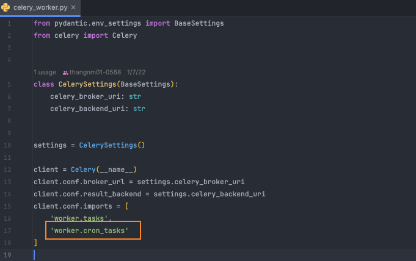

# How to Create a Cron Job with Celery

## Setting `celery_beat`

##### Create a new file named `celery_beat.py` in the `src/worker` folder

  ```python
  from pydantic import BaseSettings
  from celery import Celery
  from celery.schedules import crontab
  
  
  class CelerySettings(BaseSettings):
      celery_broker_uri: str
      celery_backend_uri: str
  
  
  settings = CelerySettings()
  
  client = Celery(
      'app',
      broker=settings.celery_broker_uri,
      backend=settings.celery_backend_uri,
  )
  
  client.conf.timezone = 'Asia/Tokyo'
  client.conf.beat_schedule = {
      # Setting up a cron job
      'task-schedule-name': {
          # This will call the worker.cron_tasks.push_encourage_user_open_app_cron function in src/worker/cron_tasks.py
          'task': 'worker.cron_tasks.push_encourage_user_open_app_cron',
          # Run every hour (3600 seconds)
          'schedule': 3600.0,
      },
      'task-schedule-monday': {
          'task': 'worker.cron_tasks.create_ex_push',
          'schedule': crontab(hour=22, minute=00),
      },
  }
  ```

- This setup will configure a Celery beat scheduler to run a task every hour by calling the `push_encourage_user_open_app_cron` function in the `src/worker/cron_tasks.py` file.
- `schedule`: Configuration-based [documentation on periodic tasks](https://docs.celeryq.dev/en/stable/userguide/periodic-tasks.html)

##### Update import `worker.cron_tasks` in `celery_worker.py`

- In file named `celery_worker.py` add  `worker.cron_tasks` in `client.conf.imports`

 ```python
  from pydantic.env_settings import BaseSettings
  from celery import Celery


  class CelerySettings(BaseSettings):
      celery_broker_uri: str
      celery_backend_uri: str


  settings = CelerySettings()

  client = Celery(__name__)
  client.conf.broker_url = settings.celery_broker_uri
  client.conf.result_backend = settings.celery_backend_uri
  client.conf.imports = [
      'worker.tasks',
      # Update here
      'worker.cron_tasks'
  ]
```



##### Modify the docker-compose-worker.yml configuration

  ```docker

    celery_beat: &celery_worker
      build: .
      image: celery_worker_dev
      volumes:
        - .:/app
      command: bash -c "cd src && celery -A worker.celery_beat.client beat --loglevel=INFO"
      env_file:
        - .env
      environment:
        ENV: prod
        CELERY_BROKER_URI: "redis://redis:6379"
        CELERY_BACKEND_URI: "redis://redis:6379"
      tty: true
      stdin_open: true

```


## Setting celery task

- Create a new file named `cron_tasks.py` with the purpose of running cron jobs:

  ```py
  from tools.push_noti import push_encourage_user_open_app
  from worker.celery_worker import client


  @client.task
  def push_encourage_user_open_app_cron():
      # Your task implementation here
      push_encourage_user_open_app.main()

  ```

  ```py
  from tools.push_noti import push_encourage_user_open_app
  from worker.celery_worker import client
  import subprocess
  
  
  @client.task
  def push_encourage_user_open_app_cron():
      # Your task implementation here
      push_encourage_user_open_app.main()
  
  
  
  @client.task
  def create_ex_push():
      command = '''
          export PYTHONPATH=. && \
          python tools/push_noti/create_push_by_push_type.py --push_time "12:30:00" --type "AFTERNOON_TIME"
      '''
  
      subprocess.run(command, shell=True, check=True, executable='/bin/bash')
  ```
